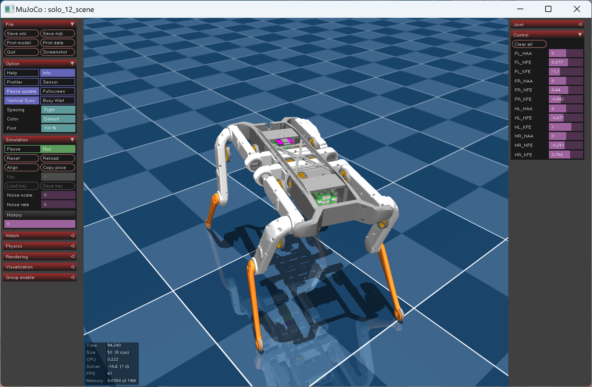
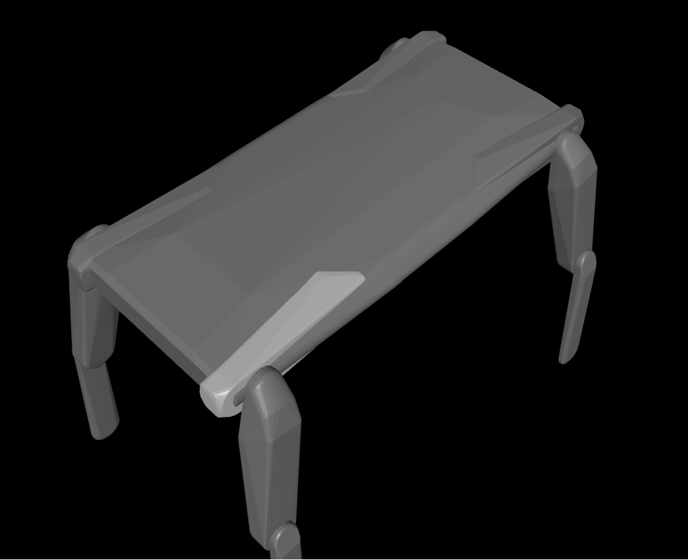
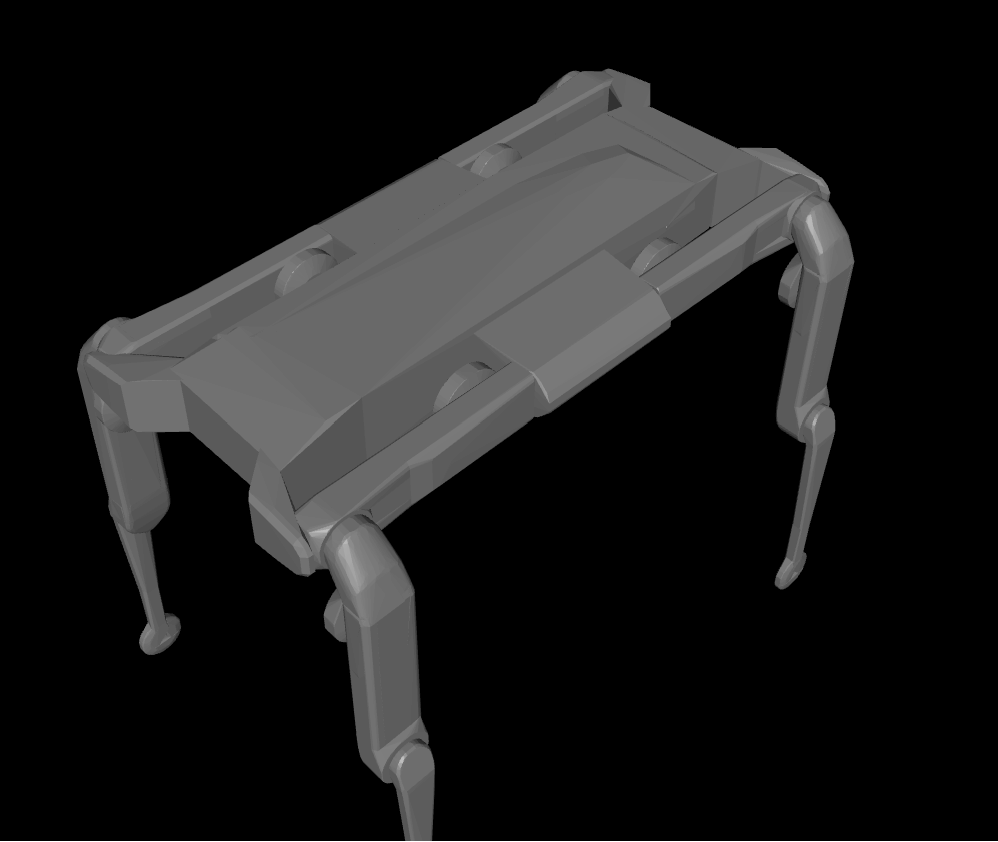

# Solo-12 MuJoCo Model

This repository contains a complete MuJoCo model of the Solo-12 quadruped, including **high fidelity visuals**:

<p float="left">
  
</p>

The model has been optimized for _loading time_ and _rendering performance_ by:

- **Removing duplicate geometry** and reusing meshes as much as possible
- **Simplifying large meshes**
- Manually **filtering** and removing **internal components**

**🤗 Please feel free to submit improvements to the model by opening a pull request!**


## Instructions
1. Install requirements: `pip3 install -r requirements.txt`
1. Generate the Solo-12 model: `python3 ./generate_model.py`
1. Start MuJoCo: `python3 -m mujoco.viewer`
1. Drag-and-drop `scene.xml` to the MuJoCo viewer to load the scene


## Modelling Details

:information_source: This section contains details about how the model was created, for reference. :information_source:

### URDF / SRDF → MJCF
1. The robot's URDF and SRDF were obtained from the [robot_properties_solo](https://github.com/open-dynamic-robot-initiative/robot_properties_solo) repository.
1. MuJoCo **compilation directives** were added to the URDF:

    ```xml
    <mujoco>
      <compiler meshdir="meshes/" discardvisual="true" fusestatic="false"/>
    </mujoco>
    ```
    _These ensure MuJoCo doesn't optimize links away by assuming the base is fixed._

1. MuJoCo's `compile.cc` **converted the URDF to an `.xml`** which was manually cleaned up and annotated.

    > The compiler re-expresses link moment of inertia along the principal axes, so original values are not preserved. _The two representations are equivalent._

1. SRDF `<disable_collisions>` elements are **manually converted to `<contact>/<exclude>`** tags.

---

### Collision Mesh Decomposition

MuJoCo calculates collisions by **replacing concave meshes with their convex hull**. This means that despite the contact exclusions, the upper leg can sometimes collide with the convex hull of the body.

**We therefore convex decompose the collision meshes:**

1. The `.stl` meshes referenced by the URDF were converted to `.obj`.
1. The `obj2mjcf` tool was ran on the meshes ([source](https://github.com/kevinzakka/obj2mjcf)). This uses **VHACD approximate convex decomposition**:

    - For the _leg meshes_ we used 6 convex hulls: 
    ```powershell
    obj2mjcf --obj-dir .\ --save-mjcf --compile-model --verbose --vhacd-args.enable --vhacd-args.max-output-convex-hulls 6 --vhacd-args.max-hull-vert-count 256 --vhacd-args.split-hull --vhacd-args.voxel-resolution 5000000 --vhacd-args.volume-error-percent 0.1
    ```

    - For the _body mesh_ we used 12, as it's a more complicated shape:
    ```powershell
    obj2mjcf --obj-dir .\ --save-mjcf --compile-model --verbose --vhacd-args.enable --vhacd-args.max-output-convex-hulls 12 --vhacd-args.max-hull-vert-count 256 --vhacd-args.split-hull --vhacd-args.voxel-resolution 1000000 --vhacd-args.volume-error-percent 0.01 --overwrite --obj-filter "solo_12_base.obj"
    ```
 
    | Before VHACD  | After VHACD |
    | ------------- | ------------- |
    |   |  |

---

### Visual Meshes
1. The robot was loaded in Solidworks and coloured according to the PLA colours I have at home :smile: ([source](https://github.com/open-dynamic-robot-initiative/open_robot_actuator_hardware/blob/master/mechanics/quadruped_robot_12dof_v1/solidworks_files/quadruped_12dof_v1.zip)).
1. For each collision mesh, the appropriate visual mesh was **exported** in `.ply` format.

    - A Python script was added to **import and orient `<geom>` elements correctly multiple times** (`generate_model.py`). This is so that duplicated geometry (_eg. actuator modules_) is not exported and loaded multiple times.
      
      >:warning: MuJoCo's `<include>` element cannot import the same file more than once.

1. The `.ply` meshes were converted to `.obj` with **Meshlab**.

    > :warning: Meshlab creates .obj meshes **with materials**. Other software might assign colours on each vertex which won't be processed by `obj2mjcf`.

1. For each mesh, Solidworks was used to _figure out the correct orientation and offset from the export origin_. Visuals were **oriented to match collision meshes** using Meshlab.

1. _MuJoCo doesn't support multimaterial / composite meshes_. The `obj2mjcf` tool was run to **split the meshes** into groups with the same material:

    ```powershell
    obj2mjcf --obj-dir ./ --save-mjcf --compile-model --verbose
    ```

1. For each submesh group, the following **simplification steps** were performed to _reduce loading times_ and _improve rendering performance_:

    - _Internal geometry was **removed**_
    - _**Mesh decimation** was performed using Meshlab's `Simplification: Quadric Edge Collapse Decimation` filter_
    - _Materials used across meshes were **merged and reused**_

1. The **hip adapter** components were exported and manually added to the **FR** and **HL** legs.
1. The materials were finally roughly adjusted for reflectivity and colour.

---

### Model
- The collision model `<geoms>` were merged with visuals and saved in separate files. **Both are imported for each link using the custom `<import_with_attrs>` component** (_see `generate_model.py`_).

- A `<joint type="free">` was added so the robot's base is free floating.

- Joint position actuators were added for each joint with test `Kp` values.
